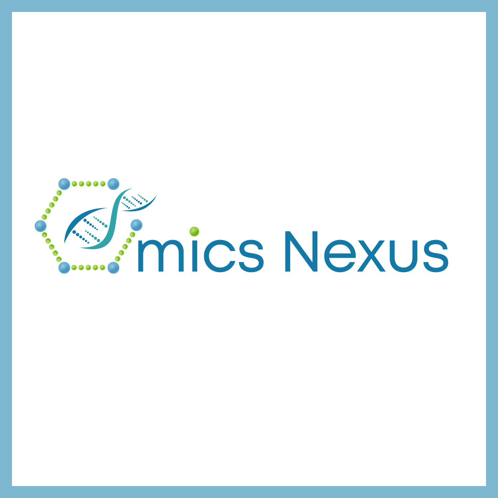

# Omics Nexus | Summer School 2026

### From Biological Data to Bioinformatics Mastery

**6 Weeks | July – August 2026 | Hands-On Training**

[Website](https://omicsnexus.org) · [Training Page](https://omicsnexus.org/training/summer-school-2026) · [Contact](mailto:info@omicsnexus.org)

---

## 📖 About the Program

The **Omics Nexus Summer School 2026** is an intensive training program for students, researchers, and professionals looking to build hands-on expertise in computational biology, transcriptomics, machine learning, and AI-driven biological discovery.

Participants work with real-world biological datasets and industry-standard tools across three progressive modules, developing skills that translate directly to research, graduate studies, and careers in bioinformatics.

This repository hosts all course materials, code, datasets, and assignments used throughout the program.

---

## 🗂️ Program Structure

| Module | Title | Focus |
|--------|-------|-------|
| **Module 1** | Foundations for Bioinformatics | Linux, Bash, Python, R, biological file formats |

---

### 🧩 Module 1 — Foundations for Bioinformatics
*From Raw Data to Biological Insight*

Build a strong computational foundation: navigating Linux environments, scripting in Python and R, and handling real biological datasets.

**Topics**
- Linux operating system and command-line navigation
- Bash scripting for automation
- Python programming fundamentals for biological data
- Reading and parsing biological file formats (FASTA, FASTQ, BED, GFF/GTF, VCF, SAM/BAM)
- Combining Bash and Python for data processing pipelines
- R programming fundamentals and data structures
- Data wrangling and EDA with the tidyverse
- Data visualization with ggplot2
- Reproducible computational workflow practices

**Hands-On Projects**
- Independent Linux/Python-based processing of real biological data files
- End-to-end data handling and visualization workflow (Bash → Python → R)
- Research-style presentation of computational workflows and findings

---

## Repository Structure

> Folder contents will be added progressively as each class takes place.

---

## Support

For questions about course content, technical setup, or registration, reach out to the Omics Nexus team:

- 📧 [info@omicsnexus.org](mailto:info@omicsnexus.org)
- 💬 [WhatsApp](https://wa.me/923414136967)
- 🌐 [omicsnexus.org](https://omicsnexus.org)

---

**Omics Nexus** — Making Bioinformatics Accessible To Everyone.

[Website](https://omicsnexus.org) · [LinkedIn](https://www.linkedin.com/company/omics-nexus/) · [X](https://x.com/omicsnexuslabs) · [YouTube](https://www.youtube.com/@OmicsNexuslabs)

